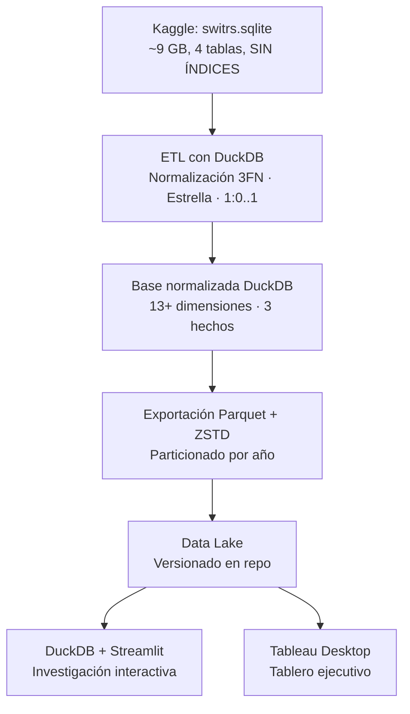

### ▶ Aplicativo en vivo: **[próximamente]**
### 📊 Tablero en vivo: **[próximamente]**

# Perfiles de riesgo en colisiones de tránsito en California (2016–2021)

Investigación estadística descriptiva sobre **colisiones de tránsito registradas en California durante seis años (2016-2021)**, que integra la tabla de hechos principal (`collisions`) con las dimensiones humanas (`parties`, `victims`) para construir perfiles de riesgo completos.

El proyecto extiende el modelo de factores y severidad incorporando **quiénes participan y quiénes resultan heridos**, separando tres magnitudes que suelen tratarse como una sola: **cuántas colisiones produce cada factor**, **qué tan graves son**, y **qué perfiles demográficos y conductuales concentran el riesgo**.

---

## 🎯 Hallazgos esperados (basados en auditoría empírica)

| Magnitud | Universo (2016-2021) | Datos validados |
|---|---|---|
| **Colisiones** | ~9.4 millones | ✅ Auditado |
| **Partes implicadas** | ~18.7 millones | ✅ Auditado |
| **Víctimas** | ~9.6 millones | ✅ Auditado |
| **Integridad referencial** | 100% | ✅ Sin huérfanos |
| **Georreferenciación** | ~29% con coordenadas | ⏳ Pendiente modelado 1:0..1 |

> **Validación temprana:** La auditoría de Fase 1 confirmó cardinalidad acotada en todas las dimensiones (máx. 32 valores), volumen que exige INTEGER en PKs (9M–18M filas), y nulos gestionables con estrategia explícita.

---

## 🏗️ Arquitectura del proyecto



### Stack tecnológico

| Herramienta | Papel | Justificación |
|---|---|---|
| **DuckDB** | Motor analítico + esquema normalizado | La fuente no tiene índices. SQLite no termina los JOINs; DuckDB usa *hash joins* y tarda **~3 s**. Lee `.sqlite` directo, sin duplicar 9 GB. |
| **Parquet + ZSTD** | Formato del Data Lake | Columnar y comprimido: **~15× menos volumen**. Particionado por año → poda de particiones automática. |
| **Streamlit** | Aplicativo de la investigación | Publica metodología, resultados y terminal SQL en interfaz navegable. |
| **Tableau** | Tablero ejecutivo | Lectura visual de métricas macro, complementaria al detalle estadístico. |

> **Este proyecto no usa pandas por lotes.** Tres operaciones son **globales** y no admiten reparto: llave subrogada correlativa, resolución de códigos contra catálogos, y construcción de la tabla de coordenadas.

---

## 📐 Metodología

Investigación de **nivel descriptivo**, diseño **no experimental** y **documental sobre fuente secundaria**. Al trabajar con el universo completo de registros, las medidas calculadas son **parámetros** y no estimadores: no se realizan pruebas de significación ni inferencias más allá del universo procesado.

### Pregunta de investigación

> ¿Cómo se distribuyen las colisiones de tránsito de California (2016–2021) según su factor primario, severidad, entorno, localización y **perfil de las partes y víctimas implicadas**, y en qué medida el orden de los factores según el número de colisiones difiere del orden según el número de personas fallecidas y heridos por perfil demográfico?

### Objetivos específicos

1. **Normalizar** la fuente hasta la Tercera Forma Normal mediante un esquema en estrella con integridad referencial verificada por el motor.
2. **Modelar la georreferenciación** como relación **1:0..1**, de modo que la cobertura del registro sea medible.
3. **Integrar las dimensiones humanas** (`parties`, `victims`) en el esquema de hechos para construir perfiles de riesgo (edad, sexo, sobriedad, uso de cinturón, ejección, posición).
4. **Construir agrupaciones** que la fuente no trae —grupos de factor primario, regiones, franjas horarias, grupos de edad— con criterios explícitos y reproducibles.
5. **Transformar** el esquema en un Data Lake columnar **particionado por año**.
6. **Calcular** distribuciones de frecuencias absolutas, relativas y acumuladas por factor, severidad, hora, condado y perfil de riesgo.
7. **Contrastar** para cada factor su peso en colisiones vs. fallecidos vs. heridos por perfil demográfico.
8. **Desarrollar** aplicativo en Streamlit y tablero en Tableau.

### Universo y unidad de análisis

| Universo | Registros | Descripción |
|---|---|---|
| **Colisiones** | ~9.4 M | Todas las colisiones SWITRS 2016–2021 |
| **Partes** | ~18.7 M | Conductores, peatones, ciclistas, etc. |
| **Víctimas** | ~9.6 M | Personas heridas o fallecidas |
| **Sub-universo geo** | ~2.7 M (29%) | Colisiones con coordenadas, relación 1:0..1 |
| **Unidad de análisis** | — | Cada colisión individual (`colision_id`) + cada parte/víctima |

---

## ⚠️ Advertencias sobre la fuente

El SWITRS es un **registro administrativo**, no un censo de siniestros. Tres consecuencias condicionan todo lo que puede decirse:

1. **Sólo existe lo que generó parte policial.** Las colisiones leves resueltas entre particulares están sistemáticamente ausentes → la letalidad verdadera es **menor** que la calculada.
2. **El factor primario es una atribución, no una medición.** Lo consigna el agente que levanta el atestado.
3. **El sistema cambió durante el período.** La georreferenciación crece del 0% al ~66%.

**Anomalías declaradas sin corregir** (corregirlas en silencio ocultaría el estado real del registro):

- El indicador de alcohol vale `1` o queda **vacío**, nunca `0` (se normaliza a 0 en el ETL).
- Códigos sueltos sin significado (`21804`, `N`, `I`, `O`, `H`, `J`) aparecen entre las categorías → caen en `Sin clasificar`.
- La suma de las clases de heridos difiere del total que declara la fuente.
- Valores atípicos detectados: `vehicle_year = 8744`, `victim_age = 999` → requieren investigación y documentación.

---

## 📁 Estructura del repositorio (estado actual)

```
analisis-colisiones-california/
├── .gitignore                    ← Excluye .vscode/, data/, venv/, etc.
├── requirements.txt              ← duckdb, pandas, streamlit, etc.
├── README.md                     ← Este archivo
│
├── auditoria/                    ← FASE 1 COMPLETADA ✅
│   ├── 01_cardinalidad_dimensiones.sql     # Validación cardinalidad < 32,767
│   ├── 02_volumen_datos.sql                # Volumen: 9M-18M filas → INTEGER PKs
│   ├── 03_nulos_e_inconsistencias.sql      # Nulos: 0% en claves, 71% en coords
│   ├── 04_duplicados_dimensiones.sql       # Duplicados "unknown" detectados
│   ├── 05_textos_repetitivos.sql           # Atributos degenerados + dim_county
│   ├── 06_integridad_referencial.sql       # 100% integridad (0 huérfanos)
│   ├── 07_distribucion_medidas.sql         # Rangos acotados → SMALLINT
│   ├── 08_resumen_ejecutivo.sql            # Consolidado de decisiones
│   └── RESULTADOS_AUDITORIA.md             # Interpretación + acciones
│
├── data/
│   └── raw/
│       └── switrs.sqlite         ← Fuente cruda (no versionada, 9 GB)
│
├── src/                          ← FASE 2 EN ADELANTE ⏳
│   ├── 01_creacion_esquema.py
│   ├── 02_poblacion_dimensiones.py
│   ├── 03_procesamiento_carga.py
│   └── 04_exportacion_parquet.py
│
├── notebooks/                    ← Exploración y validación ⏳
│
├── visualizaciones/              ← Gráficos y dashboards ⏳
│
└── assets/                       ← Recursos visuales (banner, etc.) ⏳
```

---

## 🚀 Puesta en marcha

### 1. Clonar el repositorio

```bash
git clone https://github.com/allan230807/analisis-colisiones-california.git
cd analisis-colisiones-california
```

### 2. Instalar dependencias

```bash
pip install -r requirements.txt
```

### 3. (Opcional) Descargar la base cruda

Descarga `switrs.sqlite` desde [Kaggle](https://www.kaggle.com/datasets/alexgude/california-traffic-collision-data-from-switrs) (~9 GB) y colócala en:

```
analisis-colisiones-california/data/raw/switrs.sqlite
```

### 4. Ejecutar auditoría (Fase 1 - ya validada)

```bash
# Ejecutar scripts de auditoría contra la base cruda
sqlite3 data/raw/switrs.sqlite < auditoria/01_cardinalidad_dimensiones.sql
sqlite3 data/raw/switrs.sqlite < auditoria/02_volumen_datos.sql
# ... resto de scripts
```

### 5. Reconstruir la base normalizada (Fase 2+ - pendiente)

```bash
cd src
python 01_creacion_esquema.py
python 02_poblacion_dimensiones.py
python 03_procesamiento_carga.py
python 04_exportacion_parquet.py
```

---

## 📋 Roadmap del proyecto

| Fase | Estado | Entregable | Descripción |
|---|---|---|---|
| **1. Auditoría y diseño** | ✅ **Completada** | `auditoria/` + `RESULTADOS_AUDITORIA.md` | Cardinalidad, volumen, nulos, duplicados, integridad, medidas |
| **2. Creación de dimensiones** | ⏳ **Pendiente** | `src/01_creacion_esquema.py` + `02_poblacion_dimensiones.py` | 13+ dimensiones (calendario, demográficas, entorno, junk) |
| **3. Normalización parties/victims** | ⏳ **Pendiente** | `src/03_procesamiento_carga.py` | Hechos integrados con FKs explícitas |
| **4. Tabla de hechos integrada** | ⏳ **Pendiente** | `fact_colisiones_integrada` | Métricas exactas cruzadas con perfiles de riesgo |
| **5. Exportación a Parquet** | ⏳ **Pendiente** | `data/processed/` particionado por año | Data Lake listo para Streamlit/Tableau |

---

## 📊 Fuente de datos

**California Traffic Collision Data from SWITRS** · Kaggle  
https://www.kaggle.com/datasets/alexgude/california-traffic-collision-data-from-switrs

Derivado del registro oficial de la *California Highway Patrol*:

> California Highway Patrol. *Statewide Integrated Traffic Records System (SWITRS)*. Sacramento, California.  
> https://iswitrs.chp.ca.gov/Reports/jsp/index.jsp

---

## 🎓 Créditos

Material académico elaborado para los estudiantes de la **Escuela de Estadística y Ciencias Actuariales** de la **Universidad Central de Venezuela**, asignatura **Computación II**.

---

## 🔑 Decisiones de diseño validadas en Fase 1

| Decisión | Evidencia | Impacto |
|---|---|---|
| **SMALLINT para FKs** | Cardinalidad máx. = 32 (equipamiento seguridad) | ~188 MB ahorrados por tabla de hechos |
| **INTEGER para PKs** | 9.4M–18.7M filas en hechos | Necesario para surrogate keys |
| **Atributos degenerados** | `primary_road` (333K), `vehicle_make` (6.3K) | Evita dimensiones inútiles |
| **Nueva dimensión `dim_county`** | `county_location` = 58 valores | Análisis geográfico por región |
| **Tabla geo 1:0..1** | 71% nulos en lat/lon | Cobertura medible, no oculta en nulos |
| **Corregir duplicados "unknown"** | 2 dimensiones afectadas | Integridad de FKs garantizada |

---

**Estado del pipeline:** Fase 1 completada y versionada. Siguiente: creación del esquema en estrella y población de dimensiones.